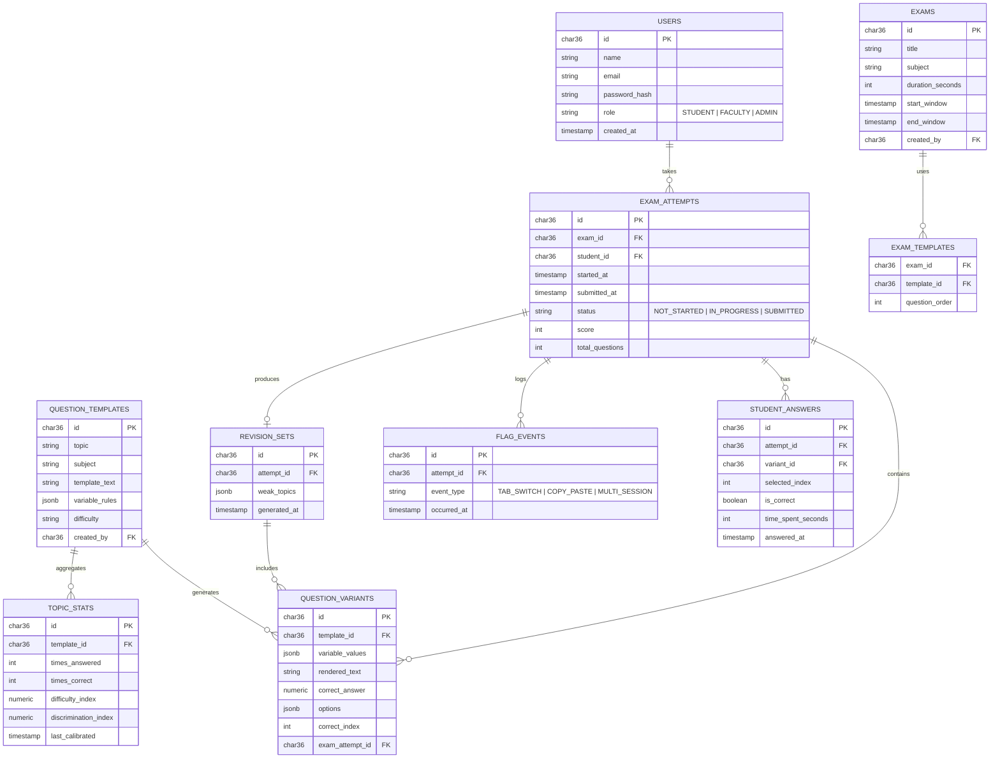

# Smart Online Examination & Assessment Platform — Database Schema & Backend Architecture

Stack assumed: **React** (frontend) + **Spring Boot** (backend, Java) + **MySQL** (database). Everything below maps directly onto the three unique features — randomized questions, auto-generated revision plans, and the live progress wall — plus the standard exam-platform capabilities.

---

## 1. Entity-Relationship Diagram



---

## 2. Core Table DDL

```sql
-- V1__init.sql (MySQL)
-- UUIDs are stored as CHAR(36) and generated by Hibernate in Java (see the
-- @JdbcTypeCode(SqlTypes.CHAR) annotation on each entity's @Id field) rather
-- than by the database, since MySQL has no native UUID type or default
-- UUID-generating expression the way Postgres's gen_random_uuid() does.

CREATE TABLE users (
  id CHAR(36) PRIMARY KEY,
  name VARCHAR(120) NOT NULL,
  email VARCHAR(160) UNIQUE NOT NULL,
  password_hash VARCHAR(255) NOT NULL,
  role VARCHAR(20) NOT NULL CHECK (role IN ('STUDENT','FACULTY','ADMIN')),
  created_at TIMESTAMP DEFAULT CURRENT_TIMESTAMP
);

CREATE TABLE question_templates (
  id CHAR(36) PRIMARY KEY,
  subject VARCHAR(80) NOT NULL,
  topic VARCHAR(80) NOT NULL,
  template_text TEXT NOT NULL,
  formula_key VARCHAR(80) NOT NULL,
  variable_rules JSON NOT NULL,
  difficulty VARCHAR(20) DEFAULT 'MEDIUM',
  created_by CHAR(36),
  created_at TIMESTAMP DEFAULT CURRENT_TIMESTAMP,
  FOREIGN KEY (created_by) REFERENCES users(id)
);

CREATE TABLE exams (
  id CHAR(36) PRIMARY KEY,
  title VARCHAR(160) NOT NULL,
  subject VARCHAR(80) NOT NULL,
  duration_seconds INT NOT NULL,
  start_window TIMESTAMP NOT NULL,
  end_window TIMESTAMP NOT NULL,
  created_by CHAR(36),
  FOREIGN KEY (created_by) REFERENCES users(id)
);

CREATE TABLE exam_templates (
  exam_id CHAR(36) NOT NULL,
  template_id CHAR(36) NOT NULL,
  question_order INT NOT NULL,
  PRIMARY KEY (exam_id, template_id),
  FOREIGN KEY (exam_id) REFERENCES exams(id) ON DELETE CASCADE,
  FOREIGN KEY (template_id) REFERENCES question_templates(id)
);

CREATE TABLE exam_attempts (
  id CHAR(36) PRIMARY KEY,
  exam_id CHAR(36),
  student_id CHAR(36),
  started_at TIMESTAMP NULL,
  submitted_at TIMESTAMP NULL,
  status VARCHAR(20) DEFAULT 'NOT_STARTED',
  score INT,
  total_questions INT,
  FOREIGN KEY (exam_id) REFERENCES exams(id),
  FOREIGN KEY (student_id) REFERENCES users(id),
  UNIQUE (exam_id, student_id)
);

CREATE TABLE question_variants (
  id CHAR(36) PRIMARY KEY,
  template_id CHAR(36),
  exam_attempt_id CHAR(36),
  variable_values JSON NOT NULL,
  rendered_text TEXT NOT NULL,
  correct_answer NUMERIC NOT NULL,
  options JSON NOT NULL,
  correct_index INT NOT NULL,
  question_order INT NOT NULL,
  FOREIGN KEY (template_id) REFERENCES question_templates(id),
  FOREIGN KEY (exam_attempt_id) REFERENCES exam_attempts(id)
);

CREATE TABLE student_answers (
  id CHAR(36) PRIMARY KEY,
  attempt_id CHAR(36),
  variant_id CHAR(36),
  selected_index INT,
  is_correct BOOLEAN,
  time_spent_seconds INT,
  answered_at TIMESTAMP DEFAULT CURRENT_TIMESTAMP,
  FOREIGN KEY (attempt_id) REFERENCES exam_attempts(id),
  FOREIGN KEY (variant_id) REFERENCES question_variants(id)
);

CREATE TABLE flag_events (
  id CHAR(36) PRIMARY KEY,
  attempt_id CHAR(36),
  event_type VARCHAR(30) NOT NULL,
  occurred_at TIMESTAMP DEFAULT CURRENT_TIMESTAMP,
  FOREIGN KEY (attempt_id) REFERENCES exam_attempts(id)
);

CREATE TABLE revision_sets (
  id CHAR(36) PRIMARY KEY,
  attempt_id CHAR(36) UNIQUE,
  weak_topics JSON NOT NULL,
  generated_at TIMESTAMP DEFAULT CURRENT_TIMESTAMP,
  FOREIGN KEY (attempt_id) REFERENCES exam_attempts(id)
);

CREATE TABLE revision_questions (
  revision_set_id CHAR(36) NOT NULL,
  variant_id CHAR(36) NOT NULL,
  PRIMARY KEY (revision_set_id, variant_id),
  FOREIGN KEY (revision_set_id) REFERENCES revision_sets(id) ON DELETE CASCADE,
  FOREIGN KEY (variant_id) REFERENCES question_variants(id)
);

CREATE TABLE topic_stats (
  id CHAR(36) PRIMARY KEY,
  template_id CHAR(36) UNIQUE,
  times_answered INT DEFAULT 0,
  times_correct INT DEFAULT 0,
  difficulty_index NUMERIC,
  discrimination_index NUMERIC,
  last_calibrated TIMESTAMP NULL,
  FOREIGN KEY (template_id) REFERENCES question_templates(id)
);
```

**Design notes**

- `question_variants` is the key table for **randomization**: it stores the *specific* values, options and correct answer a given student actually received, generated once at attempt-start and never regenerated — so grading is always against what that student was actually shown.
- `flag_events` + `exam_attempts.status`/timestamps are the two tables the **progress wall** reads from — nothing else is needed for a live dashboard.
- `revision_sets` / `revision_questions` store the **auto-generated revision plan** as real rows (not just a computed response), so a student can revisit it later and faculty can audit what was recommended.

---

## 3. Backend Architecture

### 3.1 Layered structure (Spring Boot)

```mermaid
flowchart TB
  subgraph Client
    A[React SPA]
  end
  subgraph API["Spring Boot API"]
    C1[AuthController]
    C2[ExamController]
    C3[QuestionBankController]
    C4[AttemptController]
    C5[ProgressWallController /WS]
    S1[AuthService]
    S2[ExamService]
    S3[QuestionGeneratorService]
    S4[GradingService]
    S5[RevisionPlanService]
    S6[ProgressWallService]
    S7[FlagEventService]
  end
  subgraph DB[(MySQL)]
  end

  A -- REST/JSON --> C1 & C2 & C3 & C4
  A -- WebSocket/STOMP --> C5
  C1 --> S1
  C2 --> S2
  C3 --> S3
  C4 --> S4 & S7
  C5 --> S6
  S2 --> S3
  S4 --> S5
  S1 & S2 & S3 & S4 & S5 & S6 & S7 --> DB
```

### 3.2 Module responsibilities

| Module | Responsibility |
|---|---|
| **AuthService** | JWT-based login/session, role-based access control (STUDENT / FACULTY / ADMIN). |
| **ExamService** | Create/schedule exams, attach question templates, manage exam windows. |
| **QuestionGeneratorService** | On `POST /attempts/{id}/start`: pulls each `question_template`, applies `variable_rules` server-side, computes the correct answer via the mapped `formula_key`, builds 3 distractors, shuffles options, persists a `question_variant` row. **Never sends the answer key to the client.** |
| **GradingService** | On submit: compares `selected_index` to `correct_index` per variant, computes score, writes `student_answers`, updates `exam_attempts.status/score`. |
| **RevisionPlanService** | After grading: groups wrong answers by `topic`, picks weak topics, calls `QuestionGeneratorService` again to build 2–3 fresh variants per weak topic, persists a `revision_set`. |
| **ProgressWallService** | Maintains an in-memory (or Redis-backed, for multi-instance deployments) snapshot per exam: counts of Not started / In progress / Submitted, average progress %, total flags. Pushed to faculty clients over WebSocket on every state change (answer submitted, flag logged, exam submitted) — no polling needed. |
| **FlagEventService** | Receives client-reported events (`visibilitychange`, blur, multi-tab detection) via a lightweight `POST /attempts/{id}/flag` call, writes to `flag_events`, and notifies `ProgressWallService`. |
| **ReportCardService** | Builds a downloadable PDF (score, weak topics, revision-plan pointer) from a submitted attempt, using the open-source OpenPDF library. Served as a file download by `GET /attempts/{id}/report-card`. |

### 3.3 Key API endpoints

```
POST   /api/auth/login
POST   /api/auth/register

POST   /api/exams                        (FACULTY) create exam
POST   /api/exams/{examId}/templates     (FACULTY) attach question templates
GET    /api/exams/{examId}               exam metadata

POST   /api/attempts/start               { examId } -> generates unique question_variants, returns attempt + questions (no answers)
POST   /api/attempts/{id}/answer         { variantId, selectedIndex, timeSpent }
POST   /api/attempts/{id}/flag           { eventType }   -- tab-switch, copy-paste, etc.
POST   /api/attempts/{id}/submit         -> triggers GradingService + RevisionPlanService
GET    /api/attempts/{id}/results        score, weak topics, revision set
GET    /api/attempts/{id}/report-card    downloadable PDF report card (score, weak topics, revision-plan pointer)

WS     /ws/progress-wall/{examId}        (FACULTY) live stream: per-student status, progress %, flags
```

### 3.4 Security notes

- Correct answers and `correct_index` values are **only ever computed and stored server-side**; the API response for `attempts/start` strips them before sending to the client.
- `flag_events` are the append-only audit trail faculty can review after the fact — the progress wall is just a live view over the same data.
- Rate-limit `/attempts/{id}/answer` and `/flag` per attempt to prevent scripted submission abuse.

### 3.5 Suggested repo structure

```
exam-platform/
├── backend/
│   ├── src/main/java/com/examsmart/
│   │   ├── auth/
│   │   ├── exam/
│   │   ├── questionbank/         # templates + QuestionGeneratorService
│   │   ├── attempt/              # AttemptController, GradingService
│   │   ├── revision/             # RevisionPlanService
│   │   ├── progresswall/         # WebSocket handler + ProgressWallService
│   │   └── common/
│   └── src/main/resources/db/migration/   # Flyway SQL migrations (the DDL above)
├── frontend/
│   ├── src/pages/student/
│   ├── src/pages/faculty/
│   └── src/components/
└── docs/
    └── architecture.md   (this file)
```

---

## 4. How this maps back to your 3 team roles

- **Examination Engine & Student Module** → `attempt`, `questionbank` (generator side), student-facing React pages.
- **Question Bank & Faculty Module** → `exam`, `questionbank` (template CRUD), faculty-facing exam creation UI.
- **Analytics, Security & Administration** → `revision`, `progresswall`, `flagEvent` auditing, and the faculty dashboard UI.
